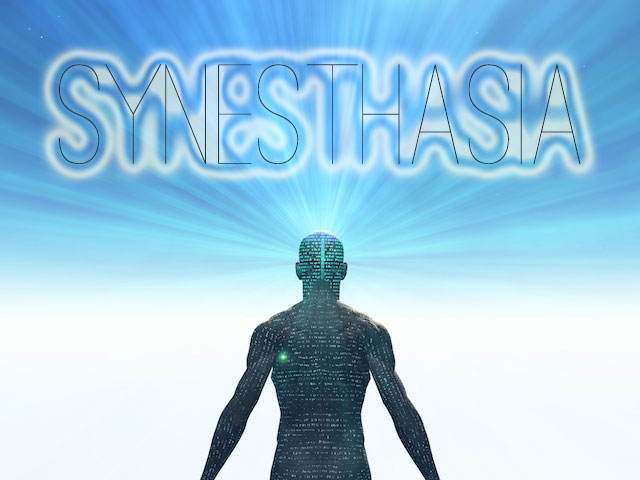

# Synesthesia

[Curation assigment for Taeyoon Choi's Concepts & Theory class](https://github.com/tchoi8/ConceptsClass/blob/master/Exhibition.md
)

This event would be equal parts exhibition, lab visit, amusement park, and spa. The goal is to create experiences that bring participants in contact with their senses in a unique way. Concept, narrative, representation and logic are to take the background in favor of raw sensory experiences. The event will run over the course of a weekend.

Connecting with Lygia Clark's practice of therapeutic experiential art. Artists are encourage to explore "neglected" senses such as touch, smell, taste, kinesthetic awareness, and attempts at a "6th sense" (brain waves or chakras, for instance). More commonly explored such as vision and hearing are also accepted, although there will be a higher bar for sophistication.

There is a sliding scale entrance fee ($5-20?), which is transferred into credits granted to each participant. Artists have the option to choose whether or not to charge credits for their experience, and how many. All artists are required to offer a period of time in which their station is offered free of charge. Each artist/group of artists is required to sign up for and work one documentation shift. 

Artists are encouraged to collaborate, perhaps each artist could provide one input and one output for a process.

## Work

A call for submissions would be sent to the SFPC community. Considerations include:

 * Feasibility based on where the project is currently
 * Justification as to how the experience will allow the user to gain new insight into the senses
 * Incorporation of uncommon sensory experiences or understandings.

## Budget
 * 9 stations/artists
 * 1 technologist for accounting/credits system
 * Budget: $6000
  * $1000 - materials grants
  * $4000 - artist/technologist stipend ($400 ea)
  * $500 - event materials
  * $500 - advertising

## Schedule

Thursday
6pm-9pm - setup 

Friday
9am-3pm - setup
3-5pm - testing & press previews
7pm-10pm - opening (includes some performances)

Saturday
12pm-10pm - open hours
8pm-10pm - performances

Sunday
12pm-7pm - open hours
6pm - closing event
8pm-on - artist meetup at a bar

Monday
12pm-8pm - strike

## Technical considerations

For the "credits" system there would need to be a basic accounting system. One idea:

A sticker printer prints a nametag for each artist, with a unique work of generative art and participant id on it. This serves as a uniqe identifier (QR code basically) that is entered into a locally-hosted database. This also keeps track of the number of credits.
Each artist station is equipped with an app that will scan nametags and allow the artist to deduct credits from the visitor's account.

Another idea:
Credits are issued as physical laser-printed tokens. Each artist is given a collection bin and can cash in credits at the end of the day.